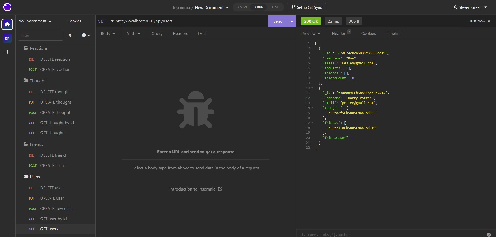
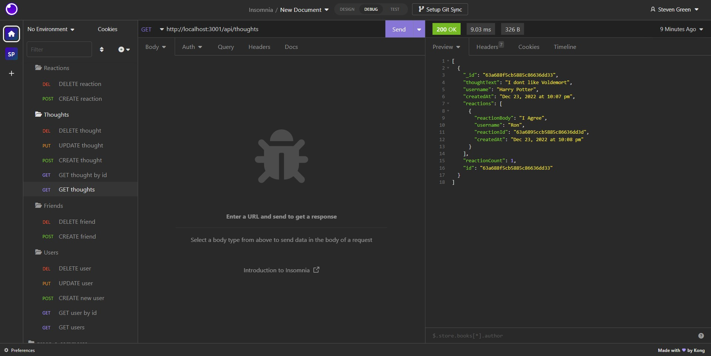

# green-social-network-api

## Description
This project is to create social network api using mongoDB and mongoose. Using insomnia I will test each GET, POST, PUT, and DELETE routes. I will show how to GET all users plus users by id, create user, update user, and delete user. Create a friend and delete a friend. GET all thoughts plus thoughts by id, create thought, update thought, and delete thought. Create a reaction to a thought and delete a reaction. 
## Table of contents
- [Mock-up](#Mock-up)
- [Installation](#Installation)
- [Usage](#Usage)
- [Contribution](#Contributing)
- [Test](#Test)
- [Questions](#Questions)
- [Diployment Links](#Questions)
## Mock-up

## Installation
express

moment

mongoose

mongoDB
## Usage
npm start
## Contributing
Steven Green
## Test
insomnia
## Questions
GitHub Username: [mrgreen12375](https://github.com/mrgreen12375)

Email Address: [ste2144105@gmail.com](ste2144105@gmail.com)
## Deployment Links
Screencastify: https://drive.google.com/file/d/1IMxe3VFSFfbu1wcxsSiY_v4-pvEV5Mck/view

GitHub Repo: https://github.com/mrgreen12375/green-social-network-api